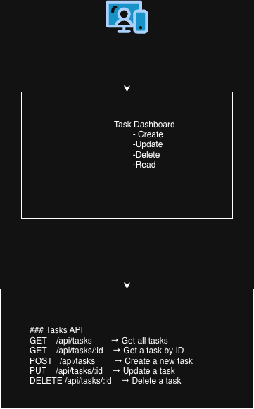

# TaskBE — Backend API (Node.js + Express)

This is the backend service for the Task Dashboard application.
It exposes a RESTful API for managing tasks using:

- In-memory storage (`Map<ID, Task>`)
- Express.js for REST API
- Controller + router architecture
- Socket.IO for real-time dashboard updates
- Jest + Supertest for backend testing

## How to Run the Backend

1. Move into the backend project directory:

   cd TaskBE

2. Install dependencies:

   npm install

3. Start the development server:

   npm run dev

4. Backend will run on:

   http://localhost:4000

## How to Test

1. npm test

## RESTful Task Management
- GET /api/tasks — list tasks
- POST /api/tasks — create task
- GET /api/tasks/:id — get one
- PUT /api/tasks/:id — update
- DELETE /api/tasks/:id — delete
- POST /api/tasks/bulk/:ids - bulk delete
- POST /api/tasks/bulk/:tasks - bulk create
- Includes createdAt and updatedAt timestamps
- Supports tags (string array)

✔ Real-Time WebSocket Updates (Socket.IO)

WebSocket events automatically broadcast changes to all connected clients:
- task:created
- task:updated
- task:deleted
- task:bulkCreated
- task:bulkDeleted
- tasks:init (initial snapshot)

